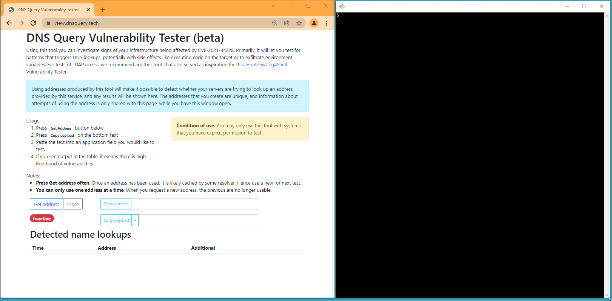

# dnsquerylog - detect DNS lookup leakage

Detect DNS lookups by providing a new, unique FQDN or the FQDN embedded in a string that is
known to trigger Log4J < 2.16 to cause a lookup of the IP address.

Author: Rickard Schoultz, 2021-2022

## Animated 30 second demo

## Requirements

In order to run this service, a number of requirements has to be met.

**1. Two public IPv4 address**. The service requires delegation. As this server will 
act as an authoritative name server for the domain, an IP address is needed to register
for this purpose. Many registries does not allow for a single IP, so two addresses are
likely needed.

**2. A domain name**, preferably a second level domain, e.g. *dnsquery.tech*. 

**3. Public access to Ports**. The following ports are used:

| Port | Protocol | Usage                                       |
|------|----------|---------------------------------------------|
| 53   | tcp      | Nameserver to be used for lookup detection. |
| 53   | udp      | Nameserver to be used for lookup detection. |
| 80   | tcp      | Letsencrypt certificate registration.       |
| 443  | tcp      | Management view.                            |

**4. Disk Storage**. The service is using Letsencrypt to acquire a certificate, and requires a directory
to store the key material.

# Disclaimer

DNSQUERYLOG IS DESIGNED TO TEST FOR SECURITY FLAWS AND CAN DO DAMAGE TO 
TARGET SYSTEMS DUE TO THE NATURE OF ITS FUNCTIONALITY. TESTING FOR SECURITY FLAWS
INHERENTLY INVOLVES INTERACTING WITH TARGETS IN NON-STANDARD WAYS WHICH CAN CAUSE
PROBLEMS IN SOME VULNERABLE TARGETS. THE USER MUST TAKE DUE CARE WHEN USING
THE SOFTWARE, MUST READ ALL DOCUMENTATION BEFORE USE AND BACK UP TARGET SYSTEMS
BEFORE USE. WHERE THE USER USES THE SOFTWARE ON PRODUCTION SYSTEMS OR OTHER SYSTEMS,
IT EXPRESSLY HEREBY ACCEPTS THE RISK OF DAMAGE AND RISK OF LOSS OF DATA OR LOSS OF
USE IN RESPECT OF SUCH DATA AND SYSTEMS AND ACCEPTS THAT IT SHOULD NOT USE THE
SOFTWARE ON ANY SYSTEMS FOR WHICH IT DOES NOT ACCEPT THE RISK OF DAMAGE,
RISK OF LOSS OF DATA OR LOSS OF USE.

